# SSL证书检测：
fastapi的练手项目，看到[mini-rbac](https://github.com/zy7y/mini-rbac)结构清晰，项目也不复杂，感觉很适合适合用来学习练手，遂在此基础上写了一个SSL证书检测、邮件预警功能。
### 基于：[mini-rbac](https://github.com/zy7y/mini-rbac)增加
- [x] 前端SSL证书管理查看
- [x] 后端改用mysql
- [x] 后端定时任务检测证书和发送邮件预警
## Docker 快速部署
### 1. clone 代码
```gitexclude
git clone https://github.com/timbir-git/fastapi-rbac.git
``` 
### 2. 修改配置文件
将`backend/.env_example`重命名`backend/.env`
调整证书检测时间和邮件发送信息
```
# 证书的检测时间。ex: [时，分，秒]，在x点x分x秒执行检测任务
certificate_check_time = [3, 30, 0]
# 邮件通知时间。ex: [时，分，秒]，在x点x分x秒执行邮件通知任务
certificate_alert_time = [3, 40, 0]
# 通知阈值，当域名证书剩余x天时通知。ex：[7,3]，剩余7天，3天时发送告警邮件
certificate_days_remaining = [7, 3, 1]

# 邮箱发件信息
mail_sender_address = sender@aaa.com
mail_from = SSL证书到期提醒
mail_smtp_server = smtp.exmail.xx.com
mail_server_port = 465
mail_sender_username = sender@aaa.com
mail_sender_password = xxx
mail_receiver = ["aa@xx.net", "bb@xx.com"]  # 使用双引号，pydantic.env_settings使用json解析
```
### 3. `docker-compose up`启动项目
访问地址：http://IP:1855
后端地址未暴露，需要暴露，启动前修改`docker-compose.yml`添加映射
```
# docker ps
CONTAINER ID   IMAGE                  COMMAND                  CREATED      STATUS      PORTS                                   NAMES
936f4d1b7680   fastapirbac_frontend   "nginx -g 'daemon of…"   2 days ago   Up 2 days   0.0.0.0:1855->80/tcp, :::1855->80/tcp   mini-web
2b36339bc5f6   fastapirbac_backend    "uvicorn main:app --…"   2 days ago   Up 2 days                                           mini-rbac
4bb6e1567b39   mysql:8.0              "docker-entrypoint.s…"   2 days ago   Up 2 days   3306/tcp, 33060/tcp                     mini-db
```
### 4. 功能截图
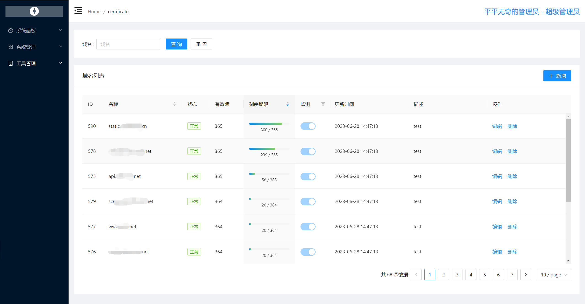
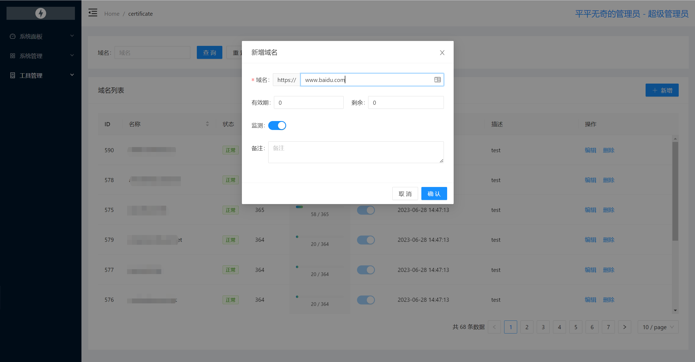
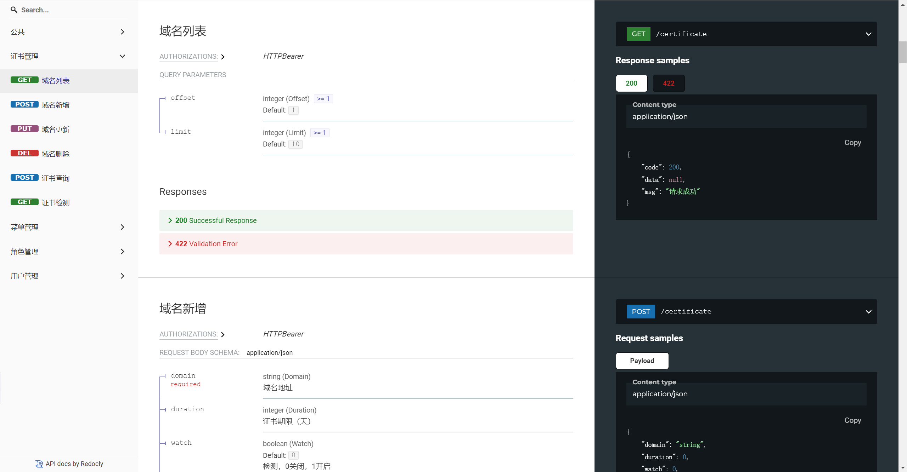

# Mini RBAC （←原项目）
`Python(FastAPI)`、`VUE3`实现，仅保留核心权限控制的极简后台管理。
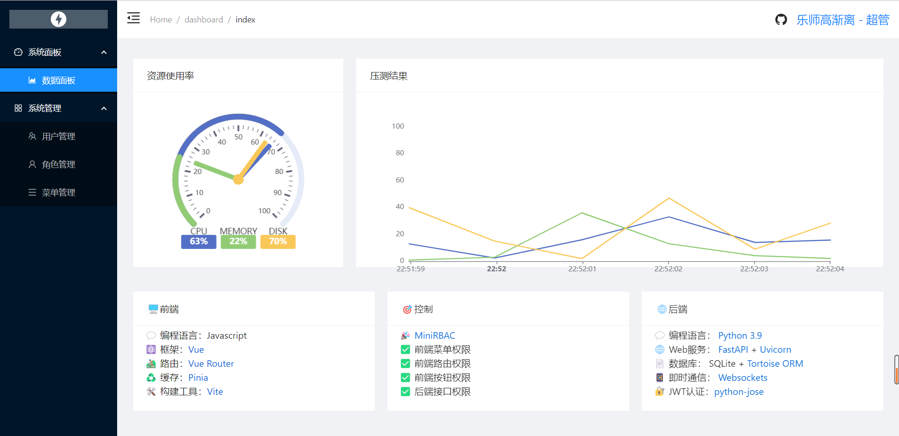

## 功能
### 权限控制
- [x] 前端菜单权限控制
- [x] 前端路由权限控制
- [x] 前端按钮权限控制
- [x] 后端接口权限控制
### 业务功能
- [x] 登录、退出、切换角色
- [x] 用户管理 -> 新增、编辑、删除、查询
- [x] 角色管理 -> 新增、编辑、删除、查询
- [x] 菜单管理 -> 新增、编辑、删除、查询


# 使用框架&工具
## 前端 `node 16.15 LTS`
```json
{
    "@kangc/v-md-editor": "^2.3.15",
    "ant-design-vue": "^3.2.12",
    "axios": "^0.27.2",
    "echarts": "^5.3.3",
    "moment": "^2.29.4",
    "normalize.css": "^8.0.1",
    "pinia": "^2.0.21",
    "pinia-plugin-persistedstate": "^2.2.0",
    "vue": "^3.2.38",
    "vue-router": "^4.1.5",
    "vite": "^3.0.9"
}
```
## 后端 `Python 3.9.7`
```
bcrypt==4.0.0
fastapi==0.82.0
passlib==1.7.4
pytest==7.1.3
python-jose==3.3.0
requests==2.28.1
uvicorn==0.18.3
tortoise-orm==0.19.2
websockets==10.3
```


<details>
<summary>更多图片</summary>

### 页面
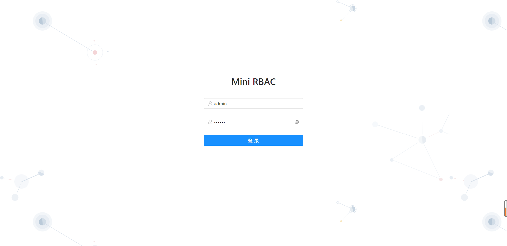
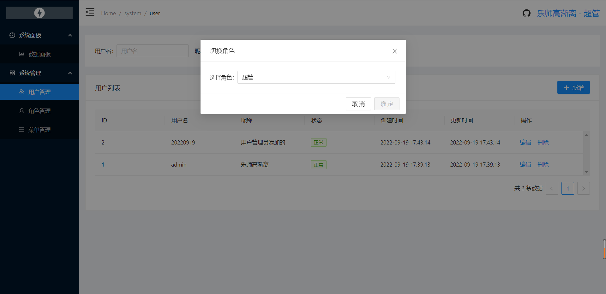
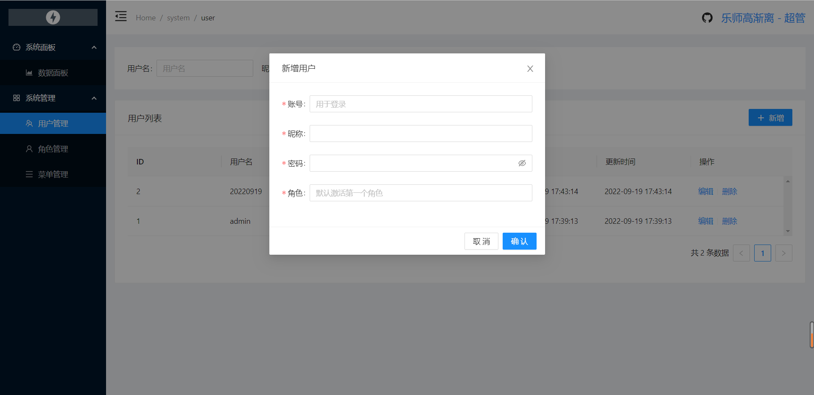
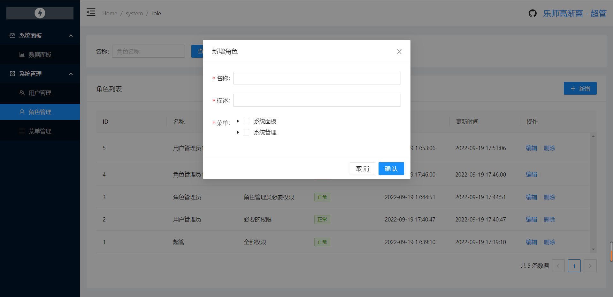
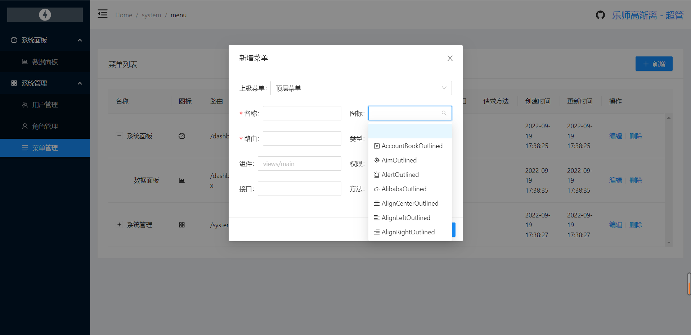
### 接口
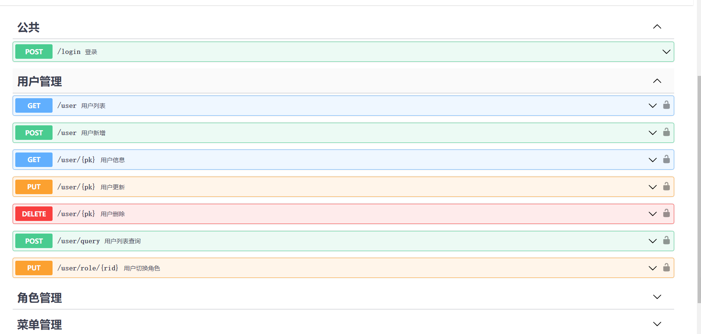
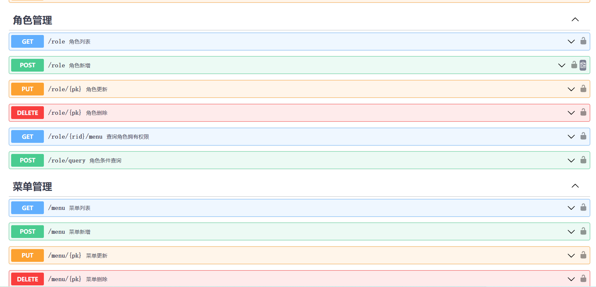

</details>
